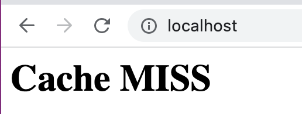
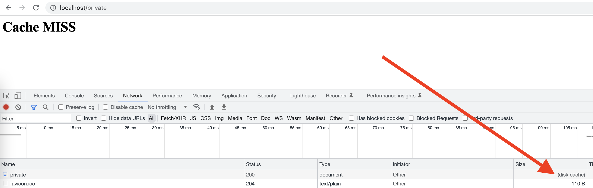
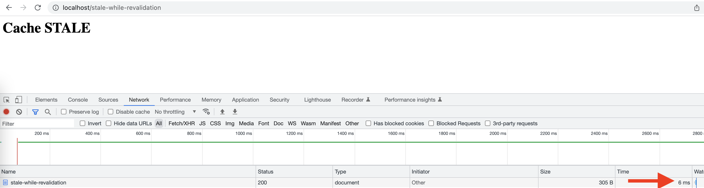
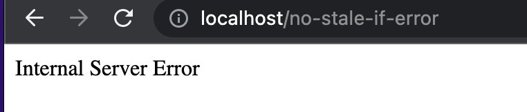

# NGINX Cache Labs

A ideia desse labs é demonstrar de forma simples como podemos utilizar o NGINX para gerar uma camada de cache controlado pela nossa aplicação e algumas casos de uso que podemos fazer a esse cache.

Para simplificar todo o processo, eu criei uma aplicação em Python com Flask, para gerar respostas simples com os headers de cache necessários para vários casos de uso. E criei também uma configuração personalizada do NGINX para demonstrar como configurar o cache nele.

## A Aplicação

A aplicação poderia ser muitas coisas, desde uma api, um cms, ou qualquer coisa que gere um conteúdo valido web, como html, json, js, etc. A aplicação de demonstração tem algumas rotas para gerar html simples mas com os headers corretos para cada tipo de situação de cache que eu quero demonstrar.

Tudo vai ser feito através do header HTTP Cache-Control, e você pode ler mais sobre ele aqui: https://developer.mozilla.org/en-US/docs/Web/HTTP/Headers/Cache-Control

## NGINX

Usamos o NGINX para fazer cache das paginas conforme as orientações da aplicação abaixo do NGINX. Ou seja, ele tem a configuração minima para o uso do cache e respeita a configuração encaminhada pela aplicação. Para fins de exemplificar o status do cache, usamos o modulo `sub_filter` para escrever no html qual o status atual do cache. Os status podem ser:

* MISS – A resposta não foi encontrada no cache e, portanto, foi buscada em uma aplicação de origem. A resposta pode ter sido armazenada em cache.
* EXPIRED – O objeto no cache expirou. A resposta contém conteúdo novo da aplicação de origem.
* STALE – O conteúdo está obsoleto porque a aplicação de origem não está respondendo corretamente e o `proxy_cache_use_stale` foi configurado.
* UPDATING – O conteúdo está obsoleto porque a entrada está sendo atualizada no momento em resposta a uma solicitação anterior e a  `proxy_cache_use_stale updating` está configurada.
* HIT – A resposta contém conteúdo novo e válido direto do cache.

Existem outras, mas vamos ficar com essas por enquanto.

A conf do NGINX ficou assim:

```
    ...
    proxy_cache_path /tmp levels=1:2 keys_zone=my_cache:1m max_size=1m 
                 inactive=60m use_temp_path=off;
    proxy_cache_background_update on;
    proxy_cache_lock on;
    ...
```

* `proxy_cache_path` é a diretiva para configurar o diretório de cache, coloquei ele no /tmp e com 1 mega pq é somente para exemplo.
* `proxy_cache_background_update` instruiu o NGINX a possibilidade de criar uma subrequest para atualizar o cache enquanto entrega o conteúdo stale para o cliente.
* `proxy_cache_lock` não influencia nas respostas de cache, mas faz que mesmo que tenham varias requisições acessando um mesmo objeto expirado ou não encontrado, somente UMA requisição vai ao backend buscar o mesmo.

```
server {
    ... 
    location / {
        sub_filter '[status]'  '$upstream_cache_status';
        sub_filter_once on;
        proxy_cache my_cache;
        proxy_pass http://app:5000;
    }

    location ~* ^/stale.* {
        sub_filter '[status]'  '$upstream_cache_status';
        sub_filter_once on;
        proxy_cache my_cache;
        proxy_cache_use_stale error timeout updating http_500 http_502 http_503 http_504;
        proxy_pass http://app:5000;
    }
    ....
```

Temos duas configurações de location para que somente as urls que contem `stale` na uri usem o parâmetro de stale, o restante é configurar o cache para ser utilizado e o sub_filter para escrever qual o status do cache.

## Como executar

Para facilitar, tudo esta em um docker compose.

```
docker compose up
````

Depois disso basta abrir seu navegador e digitar localhost, você deve ver a imagem abaixo:



# Os tipos de cache

Aqui vamos exemplificar alguns tipos e casos de uso de cache.

## public, max-age=2

O tipo de cache mais comum, a ideia é que esse conteúdo possa ser feito cache por qualquer proxy intermediário, ferramenta de cache ou navegador, e que ele tenha o tempo máximo de duração de 2 segundos. Eu sei que o tempo aqui é pouco, mas é para fins de exemplo e praticidade dos testes.

Esse caso de uso é utilizado para qualquer tipo de conteúdo estático, ou seja que não sofre alterar por usuário, seja um html, js, css, imagem, etc. O valor máximo suportado é `Cache-Control: max-age=31536000` geralmente usado para recursos com controle de versão, para os demais pode depender de cada aplicação.

O primeiro acesso na uri `/` da nossa aplicação vai acontecer um MISS, pq esse objeto nunca foi acessado antes. E o NGINX vai ir na origem, ou seja, na nossa aplicação buscar o conteúdo. Observe o nome dos containers na primeira coluna da linha.

```
NGINX-cache-labs-app-1    | 172.18.0.3 - - [25/Oct/2022 19:02:26] "GET / HTTP/1.0" 200 -
NGINX-cache-labs-NGINX-1  | 172.18.0.1 [25/Oct/2022:19:02:26 +0000] "GET / HTTP/1.1" 200 MISS
```

Logo após o primeiro MISS, os próximos acessos dentro de 2 segundos deve gerar um HIT, esses acessos não vão na origem, e são entregues diretamente do NGINX.

```
NGINX-cache-labs-NGINX-1  | 172.18.0.1 [25/Oct/2022:19:11:03 +0000] "GET / HTTP/1.1" 200 HIT
NGINX-cache-labs-NGINX-1  | 172.18.0.1 [25/Oct/2022:19:11:03 +0000] "GET / HTTP/1.1" 200 HIT
NGINX-cache-labs-NGINX-1  | 172.18.0.1 [25/Oct/2022:19:11:03 +0000] "GET / HTTP/1.1" 200 HIT
NGINX-cache-labs-app-1    | 172.18.0.3 - - [25/Oct/2022 19:11:04] "GET / HTTP/1.0" 200 -
NGINX-cache-labs-NGINX-1  | 172.18.0.1 [25/Oct/2022:19:11:04 +0000] "GET / HTTP/1.1" 200 EXPIRED
NGINX-cache-labs-NGINX-1  | 172.18.0.1 [25/Oct/2022:19:11:04 +0000] "GET / HTTP/1.1" 200 HIT
```

Você pode ver pelos logs que a cada HIT não aparece o log da aplicação, mas que após os 2 segundos de max-age, acontece EXPIRED ou seja, aquele objeto acabou a sua vida útil e foi na aplicação atualizar o conteúdo. Logo após teremos 2 segundos de HIT novamente.

## no-store

Quando você quer que não seja feito cache em nenhum tipo de nível, a diretiva no-store instrui os proxy intermediários e os navegadores a não fazer cache do objeto. Idealmente utilizado para aplicações muito dinâmicas que levam características do usuário em consideração ou que são atualizados a todo instante.

Para testar esse comportamento basta acessar a uri `/no-cache`.

```
NGINX-cache-labs-app-1    | 172.18.0.3 - - [25/Oct/2022 19:16:22] "GET /no-cache HTTP/1.0" 200 -
NGINX-cache-labs-NGINX-1  | 172.18.0.1 [25/Oct/2022:19:16:22 +0000] "GET /no-cache HTTP/1.1" 200 MISS
NGINX-cache-labs-app-1    | 172.18.0.3 - - [25/Oct/2022 19:16:22] "GET /no-cache HTTP/1.0" 200 -
NGINX-cache-labs-NGINX-1  | 172.18.0.1 [25/Oct/2022:19:16:22 +0000] "GET /no-cache HTTP/1.1" 200 MISS
```

Não importa quantos acessos você fizer, todos eles vão ser um MISS e todos eles vão ir na aplicação.

## private

O private tem um caso de uso interessante, existem casos que você gera um conteúdo especificamente para um usuário e não quer que seja feito cache em algum serviço de proxy intermediário, mas pode ser feito cache no navegador do usuário.

Se você acessar a uri '/private' da nossa aplicação vai ver o seguinte comportamento nos logs:

```
NGINX-cache-labs-app-1    | 172.18.0.3 - - [25/Oct/2022 19:23:22] "GET /private HTTP/1.0" 200 -
NGINX-cache-labs-NGINX-1  | 172.18.0.1 [25/Oct/2022:19:23:22 +0000] "GET /private HTTP/1.1" 200 MISS
NGINX-cache-labs-app-1    | 172.18.0.3 - - [25/Oct/2022 19:23:22] "GET /private HTTP/1.0" 200 -
NGINX-cache-labs-NGINX-1  | 172.18.0.1 [25/Oct/2022:19:23:22 +0000] "GET /private HTTP/1.1" 200 MISS
```

Mas se você acessar novamente essa url no seu browser você vai ver isso:



Esse disk cache mostra que o browser não foi no servidor, nem mesmo no NGINX buscar esse conteúdo, e buscou esse conteúdo do próprio cache. Isso funciona com todos os tipos de cache, como o public, e sempre respeita o tempo do max-age.

## stale-while-revalidation

Essa opção é interessante para casos em que você não quer que seu cliente fique esperando por uma requisição lenta ao backend, o primeiro acesso a esse objeto vai gerar um MISS e sim, vai demorar o tempo total da resposta, porem os demais serão feitos sempre rápidos, ou seja, o tempo de entrega do cache e o NGINX vai atualizar o objeto em background para a proxima requisição.

Depois do primeiro objeto em cache vamos gerar HITs, e quando o objeto expirar vai ser entregue um STALE, ou seja, o ultimo objeto em cache e as demais requisições ENQUANTO o objeto estiver sendo atualizado vão gerar UPDATING, e quando atualizar teremos HIT novamente e o ciclo continua. Ou seja, o NGINX atualiza o objeto em segundo plano não passando para o cliente o tempo de geração do conteúdo.

Se você acessar a uri `/stale-while-revalidation` eu propositalmente coloquei um delay de 3 segundos, ou seja, toda a requisição que for até a aplicação vai demorar 3 segundos para ser entregue.

```
NGINX-cache-labs-app-1    | 172.18.0.3 - - [25/Oct/2022 19:35:33] "GET /stale-while-revalidation HTTP/1.0" 200 -
NGINX-cache-labs-NGINX-1  | 172.18.0.1 [25/Oct/2022:19:35:33 +0000] "GET /stale-while-revalidation HTTP/1.1" 200 MISS request_time=3.009
NGINX-cache-labs-NGINX-1  | 172.18.0.1 [25/Oct/2022:19:35:38 +0000] "GET /stale-while-revalidation HTTP/1.1" 200 UPDATING request_time=0.000
NGINX-cache-labs-NGINX-1  | 172.18.0.1 [25/Oct/2022:19:35:38 +0000] "GET /stale-while-revalidation HTTP/1.1" 200 UPDATING request_time=0.000
NGINX-cache-labs-app-1    | 172.18.0.3 - - [25/Oct/2022 19:35:40] "GET /stale-while-revalidation HTTP/1.0" 200 -
NGINX-cache-labs-NGINX-1  | 172.18.0.1 [25/Oct/2022:19:35:40 +0000] "GET /stale-while-revalidation HTTP/1.1" 200 STALE request_time=3.008
NGINX-cache-labs-NGINX-1  | 172.18.0.1 [25/Oct/2022:19:35:40 +0000] "GET /stale-while-revalidation HTTP/1.1" 200 HIT request_time=0.000
NGINX-cache-labs-NGINX-1  | 172.18.0.1 [25/Oct/2022:19:35:41 +0000] "GET /stale-while-revalidation HTTP/1.1" 200 HIT request_time=0.000
NGINX-cache-labs-NGINX-1  | 172.18.0.1 [25/Oct/2022:19:35:43 +0000] "GET /stale-while-revalidation HTTP/1.1" 200 UPDATING request_time=0.000
NGINX-cache-labs-NGINX-1  | 172.18.0.1 [25/Oct/2022:19:35:44 +0000] "GET /stale-while-revalidation HTTP/1.1" 200 UPDATING request_time=0.000
NGINX-cache-labs-app-1    | 172.18.0.3 - - [25/Oct/2022 19:35:46] "GET /stale-while-revalidation HTTP/1.0" 200 -
NGINX-cache-labs-NGINX-1  | 172.18.0.1 [25/Oct/2022:19:35:46 +0000] "GET /stale-while-revalidation HTTP/1.1" 200 STALE request_time=3.009
```

Um fato curioso é que as requisições que tem o STALE também aparecem com tempo de 3 segundos, porem no navegador aparecer 6ms, isso acontece porque o NGINX usa essa requisição para contar o tempo de ida a aplicação, mas não somente para a entrega do conteúdo ao usuário.



## stale-if-error

Essa é uma boa opção para proteger os seus clientes de erros na sua aplicação. Com essa opção habilitada, sempre a tua aplicação tiver um erro de status 5xx ou um timeout o NGINX vai devolver um STALE com o ultimo objeto valido o cache, claro, caso ele tenha um objeto valido.

Essa técnica vale para casos em que é melhor entregar algo, um objeto desatualizado, do que devolver o erro.

Se você acessar a uri `/stale-if-error` existe uma chance em 3 de a aplicação devolver um erro 500. Como esta configurado para fazer cache do objeto, e também com o header de stale-if-error, depois de requisitar um objeto bem sucedido, vamos observar que apesar da aplicação entregar erro 500 algumas vezes o NGINX sempre entrega um 200 OK.

```
NGINX-cache-labs-app-1    | 172.18.0.3 - - [25/Oct/2022 21:43:56] "GET /stale-if-error HTTP/1.0" 200 -
NGINX-cache-labs-NGINX-1  | 172.18.0.1 [25/Oct/2022:21:43:56 +0000] "GET /stale-if-error HTTP/1.1" 200 MISS request_time=0.003
NGINX-cache-labs-app-1    | 172.18.0.3 - - [25/Oct/2022 21:43:59] "GET /stale-if-error HTTP/1.0" 200 -
NGINX-cache-labs-NGINX-1  | 172.18.0.1 [25/Oct/2022:21:43:59 +0000] "GET /stale-if-error HTTP/1.1" 200 STALE request_time=0.004
NGINX-cache-labs-NGINX-1  | 172.18.0.1 [25/Oct/2022:21:44:01 +0000] "GET /stale-if-error HTTP/1.1" 200 HIT request_time=0.000
NGINX-cache-labs-NGINX-1  | 172.18.0.1 [25/Oct/2022:21:44:01 +0000] "GET /stale-if-error HTTP/1.1" 200 HIT request_time=0.000
NGINX-cache-labs-app-1    | 172.18.0.3 - - [25/Oct/2022 21:44:02] "GET /stale-if-error HTTP/1.0" 500 -
NGINX-cache-labs-NGINX-1  | 172.18.0.1 [25/Oct/2022:21:44:02 +0000] "GET /stale-if-error HTTP/1.1" 200 STALE request_time=0.004
NGINX-cache-labs-app-1    | 172.18.0.3 - - [25/Oct/2022 21:44:02] "GET /stale-if-error HTTP/1.0" 200 -
NGINX-cache-labs-NGINX-1  | 172.18.0.1 [25/Oct/2022:21:44:02 +0000] "GET /stale-if-error HTTP/1.1" 200 STALE request_time=0.004
```

Note também que ele esta entregando STALE enquanto atualiza o objeto.

Mas também configurei uma uri `/no-stale-if-error` que é o que aconteceria caso não tenha essa opção habilitada, ela também uma vez a cada 3 entrega um erro 500, vamos ver o que acontece pelos logs.

```
ginx-cache-labs-app-1    | 172.18.0.3 - - [25/Oct/2022 21:48:50] "GET /no-stale-if-error HTTP/1.0" 200 -
NGINX-cache-labs-NGINX-1  | 172.18.0.1 [25/Oct/2022:21:48:50 +0000] "GET /no-stale-if-error HTTP/1.1" 200 MISS request_time=0.003
NGINX-cache-labs-NGINX-1  | 172.18.0.1 [25/Oct/2022:21:48:51 +0000] "GET /no-stale-if-error HTTP/1.1" 200 HIT request_time=0.000
NGINX-cache-labs-app-1    | 172.18.0.3 - - [25/Oct/2022 21:48:53] "GET /no-stale-if-error HTTP/1.0" 200 -
NGINX-cache-labs-NGINX-1  | 172.18.0.1 [25/Oct/2022:21:48:53 +0000] "GET /no-stale-if-error HTTP/1.1" 200 EXPIRED request_time=0.003
NGINX-cache-labs-NGINX-1  | 172.18.0.1 [25/Oct/2022:21:48:53 +0000] "GET /no-stale-if-error HTTP/1.1" 200 HIT request_time=0.000
NGINX-cache-labs-NGINX-1  | 172.18.0.1 [25/Oct/2022:21:48:54 +0000] "GET /no-stale-if-error HTTP/1.1" 200 HIT request_time=0.000
...
NGINX-cache-labs-app-1    | 172.18.0.3 - - [25/Oct/2022 21:49:02] "GET /no-stale-if-error HTTP/1.0" 500 -
NGINX-cache-labs-NGINX-1  | 172.18.0.1 [25/Oct/2022:21:49:02 +0000] "GET /no-stale-if-error HTTP/1.1" 500 EXPIRED request_time=0.002
```

O que vemos nas ultimas duas linhas que é quando a aplicação entrega um erro 500 o NGINX também devolve o mesmo.

